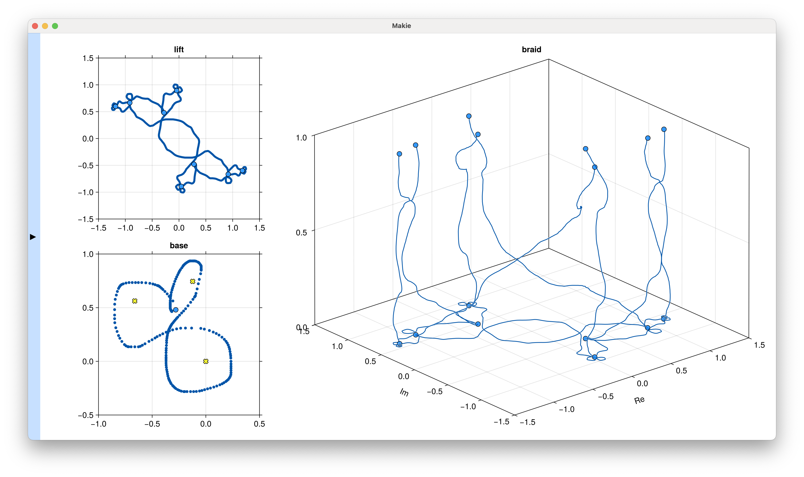

<p align="center"></p>

# Description

Small interactive tool for visualizing monodromy and numerically calculating the monodromy action. The interface is all written with [GLMakie.jl](https://github.com/MakieOrg/Makie.jl).

This is mainly for small examples and educational purposes. The actual implementation is far less sophisticated than what you can find in [HomotopyContinuation.jl](https://www.juliahomotopycontinuation.org) except insofar as this package works with non-polynomial maps. Their restriction to polynomials is what allows their use of Smale's theory to certify root calculations. Of course, it's not possible (yet, that I know of) to certify a *path*, which would be quite interesting -- then we could provably numerically calculate a monodromy group.

In this package, each monodromy step comprises one step of Euler's method followed by two steps of Newton for path correction. This seems more than adequate in small-degree examples for which this tool is intended (a testament to path correction) but is an area for improvement.

If you have comments, questions, or find a cool-looking example, I'd love to know!

# Very quick guide

Run any of the following:

```
interact_power(;degree=4)
interact_chebyshev()
interact_rabbits()
interact_symmetric_seven()
```

You will see a window with three plots: the lift and base on the left, and a 3D plot on the right. You can draw paths on the base plot with your mouse, and they will be lifted to the provided fibers. At the same time, the 3D plot will show those paths plotted against time, so you can see how they braid.


Mouse controls:

- MB3 (on base): reset plots
- MB2 / MB1+Opt: animated retrace of the current path
- MB2+Shift / MB1+Opt+Shift: instant retrace of the current path
- Scroll: zoom in or out
- MB2-drag: pan around (be careful not to clear! this binding will likely change to shift+left)

Panel controls:

- Smooth: if your paths look rough, you can smooth them and optionally toggle on automatic smoothing. Usually this doesn't actually make the lift better.
- Close: paths close automatically by default.
- Lift: animated by default, button is alternative to mouse.
- Get Permutation: reports its best guess at the permutation for your current path. It will likely error if it is not a loop.
- Red Buttons: not functioning right now, but will one day.

# Quick guide

First, define a self-cover of the Riemann sphere. To be considered étale, you must provide lifting data (the derivative) and the branch locus (at which we imagine punctures have been made, and further punctures on its preimage).

```
f(z) = z^3 - 12z
df(z) = 3z^2 - 12
branches = Set([-16 + 0.0im, 16 + 0.0im])
F = ComplexEtaleCover(f,df,branches)
```

To experiment with it, call `interact` and provide:

- your cover
- a dictionary of fibers over the base point
- the actual base point
- limits for the lift plot
- limits for the base plot

The names are used as symbols when representing the permutation, and for display on the plot.


```
fibers = Dict(:z => 0.0im, :a => 3.45 + 0.0im, :b => -3.45 + 0.0im)
base_pt = 0.0im
ll = (-5,5,-3,3)
lb = (-25,25,-20,20)
plotdata = interact(F, fibers, base_pt, ll, lb)
display(plotdata[:fig])
```

If you don't have fibers or a base in mind, you can instead give it just one point to use as a fiber. From there, you can find others by using the monodromy method :)

A rough heuristic for deciding the limits:

- Base limits should make all branch points visible, perhaps roughly centered around them, with some room for drawing
- If the degree is $d$, then the lifted axis dimensions should be roughly a $d$ th root of the base axis dimensions. When the map takes the real line to itself, lifts tend to flatten toward the axis.

Usually you'll want to tweak the limits after drawing your first paths (or while determining your fibers).

# Long guide

Almost all the current functions are documented. Reading the examples shows you how to run more visual calculations. Currently there are no examples for the non-visual uses. Those are handled by:

- `piecewiselinear` in `paths.jl`: returns a path with specified vertices.
- `lollipop` in `paths.jl`: returns a "lollipop" shaped path from one point around another by attaching two lines and a circle of specified radius.
- `monodromy_permutation` in `lifting.jl`: returns the permutation associated to a loop's action on named fibers.

Note that my groups all act from the right, so that $g \in G$ acting on $x \in X$ is $x^g$ rather than $g(x)$.


# Planned features

Suggestions welcome. Most of the very small interface tweaks will be finished soon, and are just listed here for me.

## Mathematical

	- Integrate with `GAP.jl` to calculate and name the groups (when small).
	- Better algorithms and implementations.

## Technical

	- Saving and loading paths to files.
	- Split off the interactivity into an extension or separate package to reduce load time when not using them.
	- More "safety" features like checking that fibers are, in fact, fibers.

## Interface

Most of these will have a button or hotkey associated. The current controls are entirely by mouse.

	- Saving paths (see above).
	- Undo/redo.
	- Hide interface and export animation.
	- Record new fiber.
	- Menu with some standard maps? or allow input? (I removed this a while ago)
